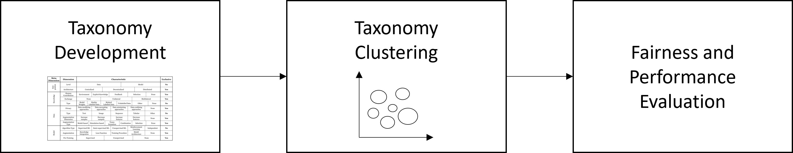

# Not enough Data to be Fair? Evaluating Fairness Implications of Data Scarcity Solutions (Online Appendix)

The following repository contains the online appendix for the paper "Not enough Data to be Fair? Evaluating Fairness Implications of Data Scarcity Solutions". It not only provides the python code for all experiments conducted in the fairness evaluation but also background for the taxonomy development and clustering. Below you find the overall structure of the research project:

Furthermore, the following sections will briefly describe the steps conducted within each cycle.

## [Step 1: Taxonomy Development](Step1_TaxonomyDevelopment/README.MD)
In the first step the taxonomy is developed following the procedure proposed by Nickerson et al. (2013) and Kundisch et al. (2022).

## [Step 2: Taxonomy Clustering](Step2_TaxonomyClustering/README.MD)
In the second step of our paper, we applied the KMeans clustering algorithm to group the 209 samples structured according to the taxonomy.

## [Step 3: Fairness and Performance Evaluation](Step3_FairnessAndPerformanceEvaluation/README.MD)
Finally, the data scarcity solution archetypes were assessed for fairness and performance using the LendingClub dataset in conjunction with US census data.

## Additional Notes
- All code provided as part of this project is written in Python 3.8