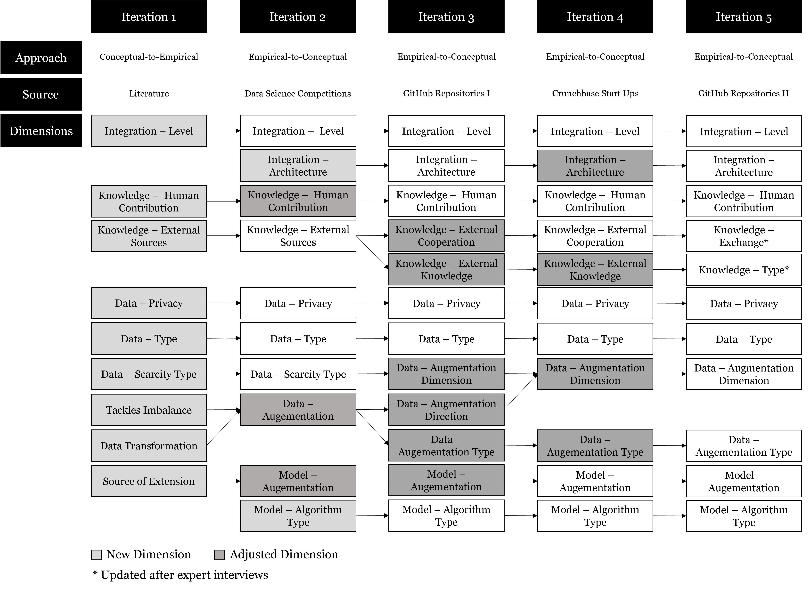
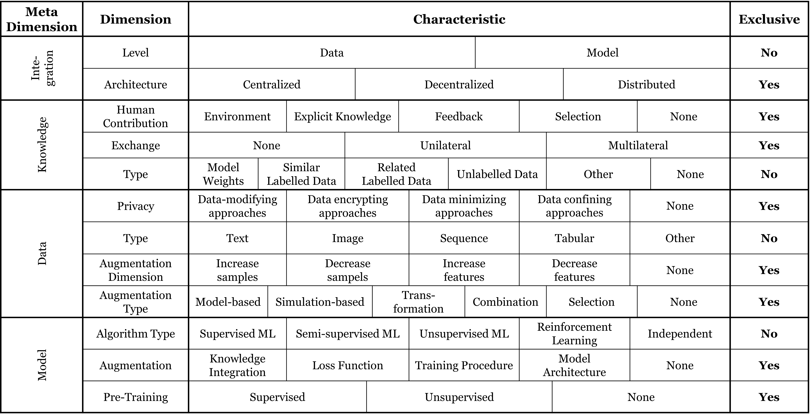

# Step 1: Taxonomy Development

In the first step the taxonomy is developed following the procedure proposed by Nickerson et al. (2013) and Kundisch et al. (2022).
The following graphic shows the development process of the proposed taxonomy:

In the picture below the taxonomies is visualized as a morphological box:

Furthermore, the excel files in this directory contain the samples incorporated into the taxonomy in every cycle.
